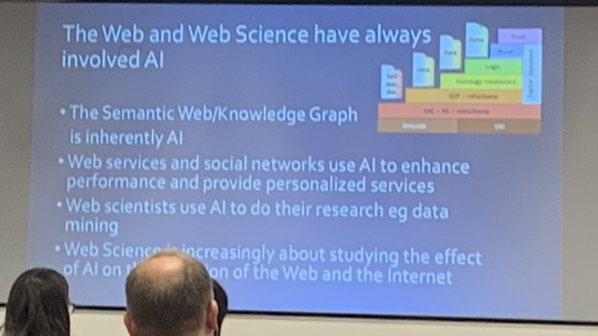

# Ontology work

This folder contains ontology work in progress.

The older branches - firstly worked to illustrate the opportunity to develop Human Rights ontologies, and then more recent work did some basic experimentation; prior to this new direction, in the lead-up to 2023...  (may it be a big year, in a very positive way!! )

### BACKGROUND INFO
This project aims to produce the ontological frameworks required by biosphere agents to supplement those already made for other concepts.

Human Rights Acts (such as those curated by the UN) couldn't be found in an RDF / Semantic Web Format.  This is one of the many components to many important concepts relating to our natural world and personhood, for natural persons (homo Sapiens) that doesn't appear to be readable by AI at present.   So this disaffects 'semantic inferencing'

[image source](https://twitter.com/DameWendyDBE/status/1172470883610431489)

Other ontological works will be built on top of this, alongside more functionally useful capacities that'll be built into a .eco site in time.

### UPDATE

This work is intended to support the Webizen Project alongside others.  More information about that soon...  

# Ontologies

This REPO is working on how to improve support for ontologies.  It is a work in progress and it is early days.

## Ontology NOTES

### TTL Files 
The vast majority of the work done so far is to create a collection of files that are formatted in turtle.  

### JSONLD 
Some JsonLD files have been produced, but not as many as the turtle files.

### OtherAndWip
The 'Other and WIP' folder, has some stuff that's found and noted; but not processed in any meaningful way yet.

## General Notes.

### WIP - There's alot to do.

Some Ontology resources include (but are not exclusive to);
- https://prefix.cc/
- https://lod-cloud.net/

## Archive Copies
Some archive copies of some significant ontology libraries have been added; to be processed later. 

### HTTP Ontology Disappearances
It is common for old ontologies to no-longer be located on the URIs they were available on, when they were first made.  Work is being done to sort some of these problems out (at least - that's part of the broader objectives).

## Copyright & Licenses
The copyright and license information for different files should be in the files, but if its not - then i'll be getting to that soon.

### Other Notes
https://www.w3.org/wiki/DataSetRDFDumps